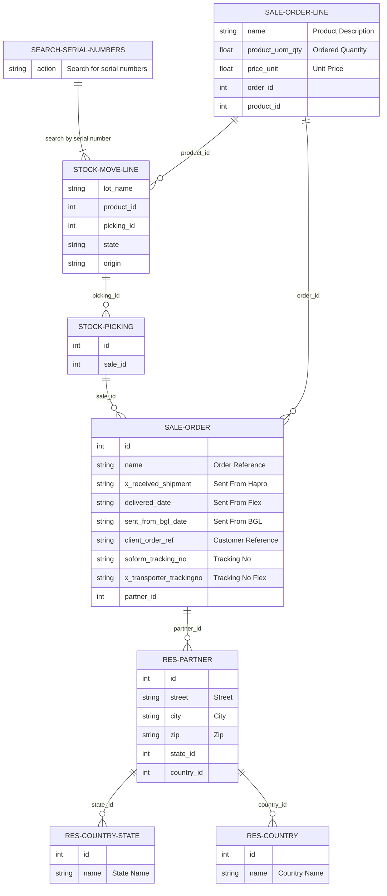

# Integration-JSM-Odoo
*Main function of integration*

## Introduction
Integration for JSM and Odoo. Takes a JSM webrequest (POST) as input and fetches data from Odoo. Returns data to JSM automation to update ticket.
Created by Computas AS Oslo :smile:

## Special considerations
1. Prioritizes kit names when returning product info. To achieve this without hardcoding product names to prioritize, it simply gets all products associated with the serial number and selects the item that has "Kit" in the name. If no item with "Kit" is found, it will concatenate and return all the associated item names.
2. Only prod instance is running, stage can be deployed after fixing some SA permissions (access to secrets)
3. For changing passwords associated with the service, please access and add a secret version in Google Cloud Secrets Manager.
   - The secrets are named logically; odoo_prod_pass, odoo_prod_db and so on. access_password defines the password to interact with and get a token in return from the token_generator function

### Usage

- POST request
  - Headers:
    - Authorization: Bearer [token]
  - Body:

	```json
	{"fields":{
	    "serialnumber":"52129A0001,52132B0127"
	    }
	}
	```
- Requires ID-token from SA:
  - odoo_trigger_stage
    or
  - odoo_trigger_prod

## Deploy
### PROD
>gcloud functions deploy odoo_prod \
--gen2 \
--region=europe-west1 \
--source=. \
--min-instances 0 \
--max-instances 4 \
--timeout 400 \
--set-secrets= 'odoo_user'=odoo_prod_user:latest,'odoo_pass'=odoo_prod_pass:latest,'odoo_server'=odoo_prod_server:latest,'odoo_db'=odoo_prod_db:latest \
--entry-point main \
--runtime python311 -\
-trigger-http \
--service-account odoo-function-prod@integration-jsm-odoo.iam.gserviceaccount.com \
--project integration-jsm-odoo

# Data structure



## Tables and keys

- Part 3:
  - Order Reference
  - Sent From Hapro
  - Sent From Flex
  - Sent From BGL
  - Customer ref:

### stock_move_line_model = odoo.env["stock.move.line"]
key: lot_name = Serial number
- product_id: list[int, str] ie: [22, '200-000005']
- picking ID: list[int, str] ie: [757, 'Torun/OUT/00429']

### picking_model = odoo.env["stock.picking"]

### 3 sale_order_model = odoo.env["sale.order"]
Key: sale_order_id
- Order Reference: Str [SO9999]
- Sent From Hapro: Date or False [2018-01-22 10:42:31]
- Sent From Flex: Date or False [2018-01-22 10:42:31]
- Sent From BGL: Date or False [2018-01-22 10:42:31]
- Customer Reference: Str[112217000176766 and 112217000176767]
- Tracking No: int|str or False
- Tracking No Flex: int|str or False
- Customer (partner_id): list[3133, 'Company name Inc, Person']

### order_line_model = odoo.env['sale.order.line']
Key: order_id, product_id
  - `order_id` (from `sale.order` -> `sale_id`)
  - `product_id` (from `stock.move.line` -> `product_id`)
- name: Str
- product_uom_quantity: Float
- price_unit: Float

### 4 odoo.env["res.partner"]
key: id (int)
other identifier: email
fields_to_fetch = ["name", "street", "city", "zip", "state_id", "country_id", "ref", "is_company"]